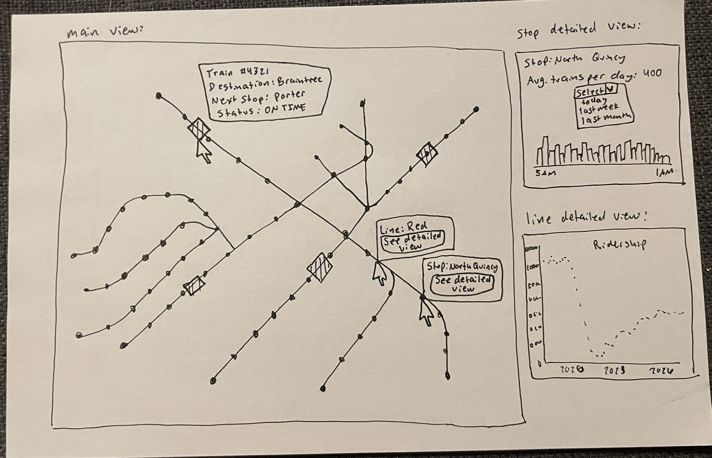

# Final Project Exploration 1

## Topic / Domain

I want to explore data related to the MBTA. There is a bunch of cool things to learn about the subway, commuter rail, bus, and ferry lines.

## Questions to Investigate Through Data Visualization

1. Which line has the largest ridership? Which has the smallest?
2. How does ridership vary throughout the week? Throughout the year?
3. How often is the subway/bus late?
4. This question is very specific to me, but I want to answer the question: what opportunities do I have to see a train on my morning commute to work? I know of 2 places where the highway passes under the commuter rail, and I have seen trains go by a handful of times. I want to optimize my commute so that I can see more trains.

## Potential Datasets/Data Sources

1. [MBTA Open Data Portal](https://mbta-massdot.opendata.arcgis.com/)
   - [MBTA Monthly Ridership By Mode and Line](https://mbta-massdot.opendata.arcgis.com/datasets/2048258a18354256a650d41f8fe4532c_0/explore)
   - [Fall 2024 MBTA Rail Ridership by SDP Time Period, Route/Line, and Stop](https://mbta-massdot.opendata.arcgis.com/datasets/d4610a65064a4d3c8536c75d520e0012_0/explore)
   - [MBTA Commuter Rail Ridership by Trip, Season, Route Line, and Stop.](https://mbta-massdot.opendata.arcgis.com/datasets/9e8089a985f24bc6a1dbae1e69703808_0/explore)

2. [MBTA API](https://www.mbta.com/developers/v3-api) (live data)

## Related Visualizations/Articles/Projects/Etc

Some websites with visualizations of MBTA data to serve as inspiration:

1. https://mbtaviz.github.io/
2. https://www.mbta.com/performance-metrics
3. https://transitmatters.org/
4. https://maps.massgis.digital.mass.gov/MassMapper/MassMapper.html
5. https://public.tableau.com/app/profile/joseph.true/viz/MBTA_15997912581680/Dashboard1
6. https://mbta.sites.fas.harvard.edu/T/subway-map.html

## Rough Sketches

1. Total ridership by line: Use data for the total ridership by line, and create circles with diameters proportional to the total ridership value for each of the lines.
   

2. Prediction accuracy: Pie chart showing the accurate predictions vs the total predictions. Drop down to allow user to select which line to look at.
   

3. Live map: use live data and visualize where each subway car is in real time.
   

4. If the line has a set schedule that doesn't vary each day (like on weekdays, for instance), record the average "actual" time, as well as recent actual times.
   

5. Another map, where you can hover over the line and it will highlight it. Possibly can include other information about the line as well.
   

## Task Analysis

1. I want to **compare characteristics** such as ridership and timeliness across different MBTA lines.
2. I want to **identify trends** related to these characteristics throughout the week and over longer time periods.
3. I want to **determine how late** each MBTA line has been historically and on average.
4. I want to **investigate the time overlap** between my commute and when the commuter rail passes over my commute to increase the likelyhood of seeing more trains.
5. I want to **investigate if there is an ideal time** to catch a bus or train into the city on a weekend.
6. I want to **search for any interesting outliers** in the data

## Validation

### Domain situation

**Validate**: Observe and interview target users

Who are my target users? Well, I think my target audience would be people who have a particular interest in transportation data. These could include people who just have an interest in all things public transportation, but this could also be people who actually use specifically the MBTA, and might want to learn things that could improve or alter their daily commute. This could even include people who make decisions regarding the MBTA, such as funding/budgeting (where to allocate money), making schedules, hiring employees, proposing expansions, etc.

If I were to actually have end users such as the ones described above, I would want to interview them and observe them to see what problems they have and what information would be useful to them to solve these problems. Do they also want to know the answers to the questions I asked earlier in this document?

[_downstream_]

**Validate**: Observe adoption rates

I could see who is actually using my visualization, and how popular it is among different groups. Possibly, it may be more popular with casual public transportation enjoyers, rather than officials doing budgeting for the MBTA.

---

### Data/task abstraction

[_downstream_]

**Validate**: Test on target users, collect anecdotal evidence of utility

I would intentify some members of my target audience(s), and have them try out the visualization tool, and let them explore and make their own discoveries about it. I would love to see if they genuinly do find utility in the tool, or if it doesn't actually solve the identified problems that they have. Possibly my target audience has background knowledge that can lend insights into the data visualization, for instance, like suspensions in a particular line which may have caused a downturn in ridership for that period of time. I think it would be really cool to see what connections they can make.

**Validate**: Field study, document human usage of deployed system

This would be intervening with the visualization tool and studying how the target users' behavior changes. I would be interested to see if the users think positively or negatively towards the new tool.

---

### Visual encoding/interaction idiom

**Validate**: Justify encoding/interaction design

I know that whatever visual encoding I choose should have proper justification for why it effectively communicates the information.

[_downstream_]

**Validate**: Qualitative/quantitative result image analysis. Test on any users, informal usability study.

I would possibly choose someone like my roommate to analyze these result images. They may or may not be part of the target audience, but they can give good feedback if something is not readable or doesn't make any sense, regardless of their background experience with the MBTA.

**Validate**: Lab study, measure human time/errors for task

I would love to see how fast users can understand the data they are looking at, and how fast they can learn how to interact with the visualization. It would also be interesting to see if there are any patterns in features that may be more difficult to understand or are easily misinterpreted.

---

### Algorithm

**Validate**: Analyze computational complexity

I think it is important to put some thought into the design of the algorithm to make sure that it is fast and cheap. Analyzing an algorithm can include using Big O notation. If an algorithm is too slow, there are most likely many well-documented tricks to speed up some of these processes.

[_downstream_]

**Validate**: Measure system time/memory

In my mind, this doesn't have to be super formal. For my purposes, I would just like to know if it feels like it loads instantly, or if it feel "laggy", to the user.

## Updated Sketches

I would like to incorporate my current work into my final project, as its own "section" in a larger interactive map. Below is my "north star" for what I want the final product to look like. There are still some aspects to be smoothed out/better defined, but I feel like this is a good goal, where I can add technical detail and more features as I implement it.

I want the main "home" screen to be a live map of the MBTA, showing where all of the train cars currently are. There are multiple opportunities for interactivity here:

1.  If the user hovers over a train car, noted by the rectangles in the sketch, it will show a tooltip containing information like its ID number, destination, next stop, and status (on time, early, late, delayed).
2.  If the user hovers over a stop, noted by the circles in the sketch, it will show a tooltip showing what the name of the stop is with a button to show a detailed view. If the user clicks the button, they will either be brought to a new page, or maybe the detailed view will appear somewhere on the current page (I'm not sure yet). Regardless, it will show info like the name of the stop, the number of trains that pass through each day, and a chart representing data of the time each train passes through the stop. Right now, I'm thinking of a bar chart showing the time of day (5am-2am, when the trains run) on the x-axis, with bars showing the trains that arrive in each "bin" of time. I also want the user to be able to select what they want to see, like only for a specific day, or agreggate the last week/month/year.
3.  If the user hovers over the line itself, it will show a tooltip showing what that line is, and a button to see the detailed view. Like point #2, I am not sure where this detailed view will show up. But, this is where I want to incorporate my existing work. This detailed view will show more general data, like total ridership for that specific line. I also want the option for the user to be able to select multiple lines to compare, or show all the lines (showing all the lines is what my implementation currently does). In addition to ridership, I also want to add other features, such as frequency (how many trains run per line per day).

Current progress that will incorporate with point #3:

